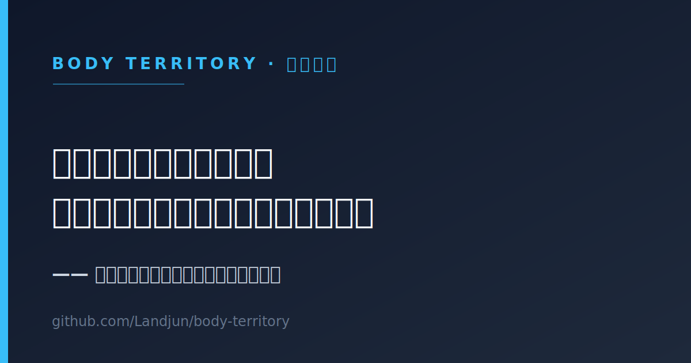

# 安全跑者品牌

<!-- MODULE-PROGRESS:START -->
> 模块进度：0 / 5 项已完成（0%）。运行 `python scripts/update_progress.py` 刷新。
<!-- MODULE-PROGRESS:END -->

这个模块是个人品牌素材库，但它不是商业包装。

## 定位

- 安全跑者是长期真实记录；
- 不是人设包装；
- 不是鸡血营销；
- 内容来源是训练、疼痛、复盘、学习、费曼输出；
- 最终可以沉淀公众号、朋友圈、文章、视频、课程脚本。

## 我的心态口径

> 让我玩吧，玩运营，玩 AI，玩跑步，玩开心，这个人生玩的开心透彻和极致。

这里的"玩"不是摆烂：

- 玩不是摆烂；
- 玩是更高阶投入；
- 把训练做成探索；
- 把复盘做成作品；
- 把身体做成系统；
- 不再只靠苦撑和证明驱动自己。

## 金句卡片

> 可直接用作公众号/社交平台配图。需要其他金句版本时，改 [safe-runner-quote-card.svg](safe-runner-quote-card.svg) 里的文字即可（SVG 是纯文本，便于版本管理）。

## 本模块文件

- [内容卡片模板](content-card-template.md)
- [每周公开记录](weekly-public-note.md)
- [安全跑者金句](safe-runner-quotes.md)

## 待补充

- [ ] 产出第一张真实内容卡片
- [ ] 发出第一条每周公开记录
